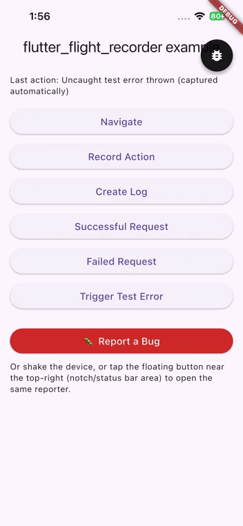

# flutter_flight_recorder

> Everything that happened before the bug.

A monorepo of three independent, separately publishable Flutter
packages that together solve one problem: when a QA engineer or user
finds a bug, developers should get the complete story of what happened
before it — with as little manual effort as possible.

<!-- Capture: a short screen recording of the full end-to-end flow —
     shake the device, the reporter opens, fill in the bug report form,
     tap submit, and the report preview screen appears. Convert to a
     GIF and save as docs/images/shake-to-report-demo.gif. Keep it
     short (a few seconds) and trimmed tightly to just that flow. -->


**Status: work in progress**, not yet published to pub.dev.

## Which package do you need?

| I want to...                                  | Install this |
|------------------------------------------------|--------------|
| Record errors, navigation, and actions          | `flutter_flight_recorder` |
| ...and also auto-record my Dio HTTP requests    | + `flutter_flight_recorder_dio` |
| ...and let QA report bugs with one tap          | + `flutter_flight_recorder_reporter` |

Most apps start with just the first package.

## Quick start

Full setup, all three packages together:

```yaml
dependencies:
  flutter_flight_recorder: ^0.0.1
  flutter_flight_recorder_dio: ^0.0.1
  flutter_flight_recorder_reporter: ^0.0.1
```

```dart
import 'package:dio/dio.dart';
import 'package:flutter/material.dart';
import 'package:flutter_flight_recorder/flutter_flight_recorder.dart';
import 'package:flutter_flight_recorder_dio/flutter_flight_recorder_dio.dart';
import 'package:flutter_flight_recorder_reporter/flutter_flight_recorder_reporter.dart';

void main() {
  FlightRecorder.init();
  runApp(const MyApp());
}

class MyApp extends StatelessWidget {
  const MyApp({super.key});

  @override
  Widget build(BuildContext context) {
    return FlutterFlightRecorderReporter(
      child: MaterialApp(
        navigatorObservers: [FlightRecorderNavigatorObserver()],
        home: const HomeScreen(),
      ),
    );
  }
}

final dio = Dio()..interceptors.add(FlightRecorderDioInterceptor());
```

Only using the core recorder? Skip the Dio and reporter lines above —
see the table above for what you actually need.

See each package's own README for its full API and configuration
options: [`flutter_flight_recorder`](packages/flutter_flight_recorder),
[`flutter_flight_recorder_dio`](packages/flutter_flight_recorder_dio),
[`flutter_flight_recorder_reporter`](packages/flutter_flight_recorder_reporter).

## Packages

* [`flutter_flight_recorder`](packages/flutter_flight_recorder) — the
  core event recorder: a bounded rolling timeline, error/navigation/
  lifecycle recording, privacy sanitization, and immutable, versioned
  incident snapshots. Zero pub package dependencies.
* [`flutter_flight_recorder_dio`](packages/flutter_flight_recorder_dio)
  — an optional Dio interceptor that records HTTP requests into the same
  timeline.
* [`flutter_flight_recorder_reporter`](packages/flutter_flight_recorder_reporter)
  — an optional QA bug-reporting UI: shake/button/manual trigger,
  screenshot capture, a bug report form, a deterministic human-readable
  Bug Story, and HTML/JSON report export.

Each package's own README covers its full quick start, API, and
limitations. Two things are documented once, centrally, and linked from
every package rather than duplicated:

* [`docs/privacy.md`](docs/privacy.md) — what's captured, what's never
  captured, when and how sanitization happens, and its one honest
  limitation (key-name matching, not content inspection).
* [`docs/platform_support.md`](docs/platform_support.md) — an explicit,
  honest platform support matrix that separates "no platform-specific
  code" from "actually verified."

## Example

[`example/`](example) is a real, runnable Flutter app demonstrating all
three packages together — see its own README for what it exercises and
a manual verification checklist for the things that can only be
confirmed on a real device.

## License

MIT — see [`LICENSE`](LICENSE). Each package also carries its own
identical MIT license.
