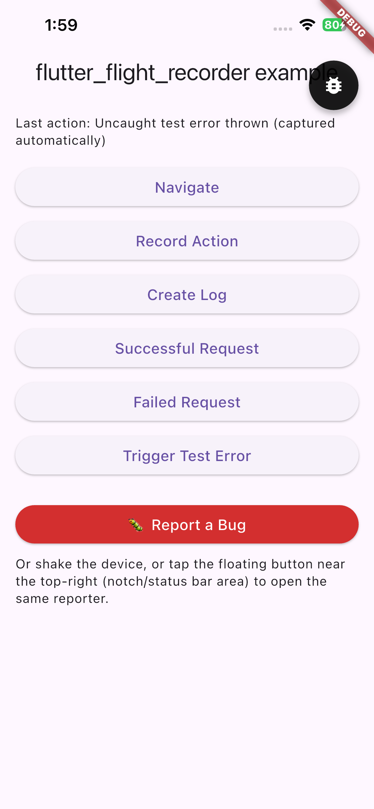

# flutter_flight_recorder example

A real, runnable Flutter app demonstrating `flutter_flight_recorder`,
`flutter_flight_recorder_dio`, and `flutter_flight_recorder_reporter`
together.

## Running it

```sh
flutter pub get
flutter run
```

For the manual checks below, you need a real device or simulator
(`flutter devices` to see what's available) — a physical device is
required for the shake gesture specifically, since no simulator can
generate real accelerometer input.

## What's on the home screen

<!-- Capture: a screenshot of the example app's home screen, with the
     floating bug-report button visible in its default position. Save
     as docs/images/example-home-screen.png. -->


| Button | Demonstrates |
|---|---|
| Navigate | `FlightRecorderNavigatorObserver` recording a real push/pop |
| Record Action | `FlightRecorder.recordAction` |
| Create Log | `FlightRecorder.log` |
| Successful Request | `flutter_flight_recorder_dio`, a real `GET` to httpbin.org |
| Failed Request | the Dio interceptor recording an HTTP 500 |
| Trigger Test Error | automatic uncaught-error capture (an unhandled async error, not a manual `recordError` call) |
| 🐛 Report a Bug | manual trigger — `FlutterFlightRecorderReporter.open(context)` |

Shake the device, or tap the floating bug icon near the top-right, to
open the same reporter through its other two triggers
(`ReportTrigger.both` is active in `main.dart`).

## Manual verification checklist

Everything in the three packages has automated test coverage, but a few
things can only be confirmed by a person on a real device — this example
exists specifically to make that possible. Check these by hand:

- [ ] **Shake gesture.** Shake the device. The reporter should open. (No
  automated test exercises the real accelerometer — every shake test in
  this repo feeds synthetic samples directly into the detection logic.)
- [ ] **Floating button placement.** The button is deliberately positioned
  `Alignment.topRight` — right where a notch, Dynamic Island, or status
  bar commonly sits. Confirm it sits clearly *below* that system UI, not
  overlapping it, on a real notched device. (This was a real bug, fixed
  with `SafeArea` + `MediaQuery.fromView` — see the reporter package's
  CHANGELOG.)
- [ ] **Screenshot appearance.** Open the reporter (any trigger) and look
  at the screenshot preview on the form. Confirm it's a correct capture
  of the home screen, not blank, not distorted, and does not include the
  reporter's own UI.
- [ ] **Share sheet (HTML).** From the report preview screen, tap "Share
  Report" and confirm the OS share sheet actually appears with a real
  `INC-XXXXXX.html` file — a single file; if you left the screenshot
  included, it's embedded inline in the HTML, not a separate attachment.
  Open the shared file in a browser or mail client and confirm it
  actually looks professional (colored severity header, timeline, etc.)
  — automated tests only check the HTML's *content*, never how it
  actually renders.
- [ ] **Share sheet (JSON).** Tap "Export JSON" instead and confirm a
  separate `INC-XXXXXX.json` file appears in the share sheet.
- [ ] **Clipboard.** Tap "Copy Summary," then paste somewhere else and
  confirm the Bug Story text actually arrived.
