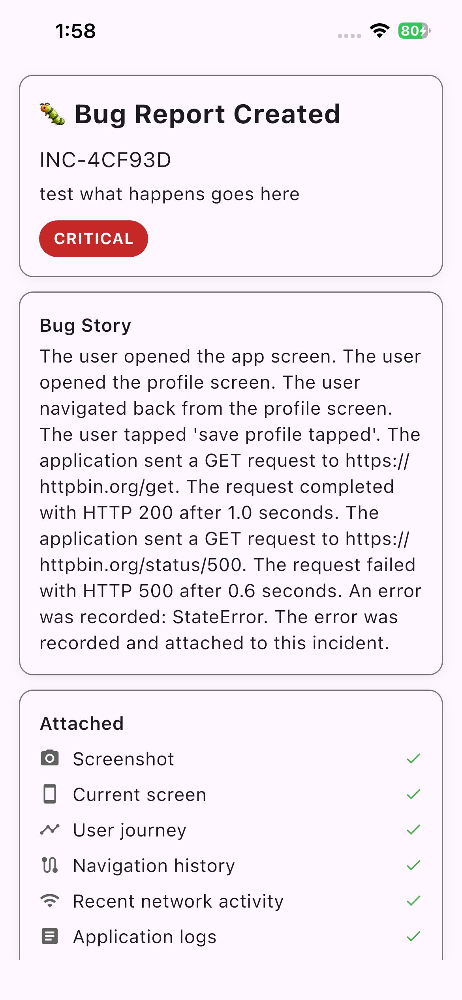
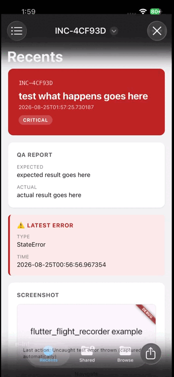

# flutter_flight_recorder_reporter

[](https://pub.dev/packages/flutter_flight_recorder_reporter)
[](https://pub.dev/packages/flutter_flight_recorder_reporter/score)
[](https://pub.dev/packages/flutter_flight_recorder_reporter/score)
[](https://opensource.org/licenses/MIT)

QA bug-reporting UI for [`flutter_flight_recorder`](../flutter_flight_recorder): shake/button/manual trigger, screenshot capture, a bug report form, and a human-readable Bug Story.

**Status: published on pub.dev.** Every code example below has been
checked against the real, current source; nothing here is aspirational.

## What problem does this solve? Why not just use a logger?

See the [core package's README](../flutter_flight_recorder#what-problem-does-this-solve)
— this package is the other half of that story: it's what turns "the
timeline exists" into "one bug → one report → everything the team
needs." A logger still leaves a
human to manually describe what happened and hunt for context; this
package captures the context automatically and just asks the human what
they saw.

## Features

* Shake, floating-button, and manual triggers, independently and
  jointly configurable, with a shared idempotent open/close lifecycle —
  no trigger can ever spawn a second overlapping instance.
* Screenshot capture that is structurally incapable of capturing the
  reporter's own UI, not just ordered to avoid it.
* A bug report form (What happened / Expected / Actual / Severity) with
  the fields QA teams typically need, no more.
* A deterministic, pure-function Bug Story generator — no AI, no
  invented causation.
* Two report formats: a professional, self-contained HTML report
  (default/primary) and machine-readable JSON (explicit/secondary) — see
  "Report formats" below.
* Zero new dependencies beyond `sensors_plus` and `share_plus`, both
  independently justified (see each's own pub.dev listing) — no `pdf`,
  no `printing`, no screenshot package.

## Installation

```yaml
dependencies:
  flutter_flight_recorder_reporter: ^0.0.1
```

## Quick start

```dart
void main() {
  FlightRecorder.init();
  runApp(
    FlutterFlightRecorderReporter(
      child: const MyApp(), // your existing app, including its own MaterialApp
    ),
  );
}
```

```dart
// Anywhere inside `child`'s subtree:
FlutterFlightRecorderReporter.open(context);
```

That's the whole quick start. Shake and the floating button are both
active by default (`ReportTrigger.both`); `.open(context)` always works
regardless of that setting.

## Architecture: why an internal `MaterialApp`, and why that's fine

This widget wraps your **entire** app, including your own `MaterialApp`.
That means, at the point where the reporter's own UI needs to render
(the bug report form, the preview screen), there's no ambient
`Localizations`/`MaterialLocalizations`/`Theme` to inherit — those come
from *your* `MaterialApp`, which is a descendant of the reporter, not an
ancestor.

So the reporter's own UI is wrapped in its own small, internal
`MaterialApp` when it opens. This is a completely separate `MaterialApp`
instance from yours — your `Navigator`, your routes, your
`FlightRecorderNavigatorObserver` (if you use one) never see it and
are never affected by it.

**Everything is built with a plain `Stack` and `ValueListenableBuilder`s
— nothing here ever calls `Navigator.push` or `showModalBottomSheet`,**
including inside that internal `MaterialApp` (the form → preview
transition is a plain `setState`, not a route push). This was a
deliberate choice, not an accident: it means a
`FlightRecorderNavigatorObserver` attached to your app's own
`MaterialApp` **never sees any navigation events from the reporter's own
UI in the first place** — there's nothing to filter or exclude, because
the reporter doesn't touch `Navigator` at all. The "exclude the
reporter's own navigation" extension point discussed when
`FlightRecorderNavigatorObserver` was built turned out to be
unnecessary, for exactly this reason.

Right-to-left apps: since the reporter's own overlay sits above your
`MaterialApp`, it has no ambient `Directionality` to inherit either, and
defaults to left-to-right. Pass `textDirection: TextDirection.rtl`
explicitly if your app is RTL:

```dart
FlutterFlightRecorderReporter(
  textDirection: TextDirection.rtl,
  child: const MyApp(),
)
```

## QA Reporter — triggers

```dart
FlutterFlightRecorderReporter(
  trigger: ReportTrigger.both, // shake, button, both, manual
  child: const MyApp(),
)
```

`.open(context)` always works, regardless of `trigger` — `manual` means
"only the manual trigger is active automatically," not "no trigger."

### Shake trigger

```dart
FlutterFlightRecorderReporter(
  trigger: ReportTrigger.shake, // or .both
  shake: const ShakeConfig(
    threshold: 15.0,                              // higher = less sensitive
    minTimeBetweenShakes: Duration(seconds: 1),    // debounce
  ),
  child: const MyApp(),
)
```

The threshold/debounce logic (`ShakeDetector`) is a small, pure class
with no dependency on `sensors_plus` or a real sensor — it's unit-tested
with synthetic accelerometer samples. The actual sensor wiring
(`accelerometerEventStream()`) lives in the reporter widget itself. A
failure to even start the accelerometer stream (e.g. an unsupported
platform) is captured by the core package's own automatic error
capture, not left uncaught — shake degrading quietly doesn't take the
rest of the reporter (button, manual trigger) down with it.

A shake — or a button tap, or another `.open()` call — while the
reporter is already open is always a no-op. It can never spawn a second,
overlapping instance.

### Floating trigger

```dart
FlutterFlightRecorderReporter(
  trigger: ReportTrigger.button, // or .both
  floatingButton: const FloatingButtonConfig(
    alignment: Alignment.bottomRight,
    padding: EdgeInsets.all(16),
  ),
  child: const MyApp(),
)
```

The button sits inside a `SafeArea` fed by the real platform view's
metrics (`MediaQuery.fromView`), so it doesn't overlap a notch, status
bar, or gesture navigation area by default — even though it renders
outside your app's own `MaterialApp` and so has no ambient `MediaQuery`
to inherit otherwise. It also hides itself automatically while the
reporter is open.

### Manual trigger

```dart
FlutterFlightRecorderReporter.open(context);
```

Works from anywhere inside `child`'s subtree, regardless of `trigger`.

## Screenshots

```dart
FlutterFlightRecorderReporter(
  captureScreenshot: true, // default
  child: const MyApp(),
)
```

Uses `RepaintBoundary` + `RenderRepaintBoundary.toImage()` directly — no
screenshot package dependency. Capture happens **before** the reporter's
own UI is shown, and — more importantly — the reporter's own UI is never
inside the `RepaintBoundary`'s subtree in the first place (it's a
separate `Stack` layer, added only once the boundary has finished being
the sole thing on screen). Structurally, the reporter cannot capture
itself, independent of timing.

If capture fails (returns `null` — no boundary attached, decode
failure, etc.), the form shows "Screenshot unavailable" rather than
silently proceeding as if nothing happened or crashing the flow. Before
submitting, QA sees the screenshot preview and can exclude it with a
checkbox.

## The bug report form

<!-- Capture: a screenshot of the bug report form fully visible on
     screen — What happened / Expected / Actual / Severity fields filled
     in with example text, and the "Automatically attached" checklist
     with its icons visible below them. Save as
     docs/images/qa-report-form.png. -->


What happened (required), Expected, Actual, Severity (required:
Low/Medium/High/Critical), and the "Automatically attached" checklist —
each item with its own icon (camera for Screenshot, phone for Current
screen, timeline icon for User journey, route icon for Navigation
history, wifi for Recent network activity, article icon for Application
logs, info icon for App information). No other fields — deliberately,
to avoid unnecessary form fields.

`FlightRecorder.createIncident` is called with the "What happened?" text
as `title`, and Expected/Actual/Severity as `QaReportData`. There's no
separate `description` field collected by this form.

## Bug Story

```dart
BugStoryGenerator.generate(incident); // String
```

A pure, deterministic function over `incident.timeline`, independently
unit-tested. It narrates navigation, action, network, and error events
in order; `log` and `lifecycle` events are deliberately left out of the
narrative (they're development-facing detail, not user-journey story),
though they remain in the raw timeline. If a network event has no
duration recorded, the duration clause is omitted — nothing is invented.

## Report preview screen

After an incident is created, the preview screen shows it in three
card-like sections — header (incident ID, title, a color-coded severity
badge), Bug Story, and the Attached checklist — with a brief (~350ms)
fade + slide entrance, which respects the platform's reduce-motion
setting (`MediaQuery.disableAnimations`) by skipping straight to the end
state instead of animating.

## Exporting JSON and sharing (Report formats)

<!-- Capture: a short screen recording scrolling through a generated
     HTML report opened in a desktop browser — showing the
     severity-colored header banner, incident ID/title, and the event
     timeline below it. Save as docs/images/html-report-browser.gif. -->


Two formats, both zero-dependency (no `pdf`/`printing` package, no new
dependency of any kind — pure Dart string templating for HTML, and
`dart:convert` for JSON, both already available):

* **HTML — the default, primary shareable format** (`Share Report`
  button). A single, self-contained HTML file: a severity-colored header
  banner, incident ID/title/timestamp, QA report fields, a prominent
  "Latest Error" callout when an error is present, a styled timeline
  (one row per event, distinct color/icon per category, including
  action/log metadata rendered as `key: value` pairs), the screenshot
  embedded inline as a base64 `` — no separate file, no external
  reference — and a footer with `schema_version` and context. Opens
  correctly in any browser or mail client preview with no extra
  software.

  ```dart
  final html = IncidentHtmlReport.render(incident, screenshot: screenshotBytes);
  ```

  This is the one part of the sharing pipeline that's public API — you
  can call it directly to generate a report outside of the QA reporter
  UI entirely (for your own tooling, tests, etc.). The share buttons
  themselves are wired to an internal helper that isn't exported; use
  the buttons, or `IncidentHtmlReport.render`/`incident.toJson()`
  directly, not something in between.

* **JSON — the explicit, secondary format** (`Export JSON` button), for
  developers/backends/tooling that need to parse the report
  programmatically. Still `incident.toJson()` (from the core package),
  still versioned via `schema_version`.

Both formats are shared entirely in memory via `XFile.fromData` — no
`path_provider` dependency, no temp file written to disk. One thing
worth calling out because it wasn't obvious going in: `XFile.fromData`'s
own `name:` parameter is silently ignored by `cross_file` on every
platform except web — the filename actually used comes from
`ShareParams.fileNameOverrides` instead. Found and fixed via this
package's own test suite.

The HTML renderer only ever reads from the `Incident` object it's given
— event metadata was already sanitized by the core package's `Sanitizer`
before it ever entered the buffer, so the renderer never sees raw
unsanitized data and never needs to re-sanitize anything; it only
HTML-escapes values for safe rendering. Full detail in
[`docs/privacy.md`](../../docs/privacy.md).

Failures from either format (the platform share sheet erroring, etc.)
are caught at the call site and shown in the UI — never silently
swallowed. `Copy Summary` (the Bug Story as plain text, via the OS
clipboard) is unaffected by any of this.

## Platform Support

See [`docs/platform_support.md`](../../docs/platform_support.md) for the
full matrix. Short version: the form/preview screen/screenshot capture
have no platform-specific code (pure Flutter SDK). Shake
(`sensors_plus`) and sharing (`share_plus`) both declare support for all
six platforms, but **neither has actually been exercised on a real
device or through a real platform channel** — every test in this
package mocks both the accelerometer channel and the share platform.
Shake is realistically only meaningful on a physical Android or iOS
device regardless of what the plugin declares, since desktop/web
generally have no real accelerometer.

## Performance

* Screenshot capture only runs when the reporter actually opens, never
  ambiently.
* The HTML report is built with a single `StringBuffer` pass over the
  timeline — no intermediate DOM, no template engine.
* Sharing is entirely in-memory (`XFile.fromData`) — no disk I/O.
* The entrance animation is a single, non-repeating 350ms
  `AnimationController` — it does not run while the reporter is closed,
  and respects `MediaQuery.disableAnimations`.

## Security and Privacy

Covered fully in [`docs/privacy.md`](../../docs/privacy.md). The one
thing specific to this package: a **screenshot** is a pixel capture, not
structured metadata, so it isn't covered by key-name masking — QA sees
the screenshot preview and can exclude it before submitting, which is
the actual privacy control for that specific piece of data.

## Limitations

* No screenshot embedded in the `Incident`/JSON schema — screenshots are
  reporter-only, in-memory state, attached only to what gets shared (as
  a separate PNG is no longer even an option — it's embedded in the HTML
  or omitted), not to the core package's versioned export shape.
* No Navigator 2.0 / go_router / auto_route awareness (inherited
  limitation from the core package's navigation observer).
* No automatic gesture tracking beyond the explicit triggers above.
* Shake and sharing are both real device/platform-channel features that
  have not actually been exercised outside of mocks — see "Platform
  Support."
* The floating button has no automatic collision avoidance with your
  app's own UI (e.g. your own FAB) beyond `SafeArea` — if you use both,
  position one of them explicitly via `FloatingButtonConfig.alignment`.

## Roadmap

No committed roadmap beyond the limitations above. A PDF export format
was explicitly considered and rejected for now, to keep this package at
zero new dependencies beyond `sensors_plus`/`share_plus` — HTML already
covers the "professional, shareable, opens anywhere" need without a
`pdf`/`printing` dependency.

## Contributing

Same as the [core package](../flutter_flight_recorder#contributing) —
this is a young, actively maintained project without a formal, separate
contribution process for this package yet.

## License

MIT
